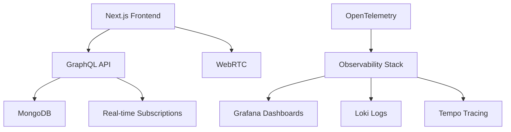

# CallMiracle

A video communication platform built with Next.js, GraphQL, and WebRTC.

[](https://nextjs.org/)
[](https://www.typescriptlang.org/)
[](https://graphql.org/)
[](https://www.mongodb.com/)
[](https://www.docker.com/)

## Features

- Real-time video calls with WebRTC
- GraphQL API with subscriptions
- User authentication and profiles
- Group management and messaging
- Push notifications
- Internationalization support
- Observability with OpenTelemetry

---

## Tech Stack

### Frontend
- Next.js 14 with App Router
- React with TypeScript
- Tailwind CSS
- Custom WebRTC hooks
- Context-based state management

### Backend
- GraphQL API
- MongoDB database
- NextAuth.js authentication
- WebRTC signaling
- Real-time subscriptions

### Infrastructure
- Docker containerization
- OpenTelemetry instrumentation
- Grafana dashboards
- Loki log aggregation
- Tempo distributed tracing

---

## 🏗️ **Architecture Overview**



### **Key Technical Components**

| Component | Technology | Purpose |
|-----------|------------|---------|
| **Frontend** | Next.js 14, TypeScript, Tailwind | Modern React SPA with SSR |
| **API Layer** | GraphQL, Next.js API Routes | Type-safe backend services |
| **Database** | MongoDB | Scalable document storage |
| **Real-time** | WebRTC, GraphQL Subscriptions | Video calls & live updates |
| **Auth** | NextAuth.js | Secure authentication |
| **Monitoring** | OpenTelemetry, Grafana | Production observability |
| **Deployment** | Docker, Docker Compose | Containerized infrastructure |

---


## Getting Started

```bash
# Clone the repository
git clone https://github.com/yourusername/callmiracle.git
cd callmiracle

# Install dependencies
yarn install

# Start development server (runs on port 3003)
yarn dev

# Visit http://localhost:3003
```

### Observability Stack
```bash
# Start complete observability stack
docker-compose -f docker-compose.observability.yml up -d

# Access monitoring
- Grafana: http://localhost:3000
- MongoDB: localhost:27017
```

---


## Available Scripts

```bash
yarn dev          # Development server (port 3003)
yarn build        # Production build
yarn start        # Production server
yarn lint         # Code linting
yarn typecheck    # Type checking
```

---

## License

MIT
